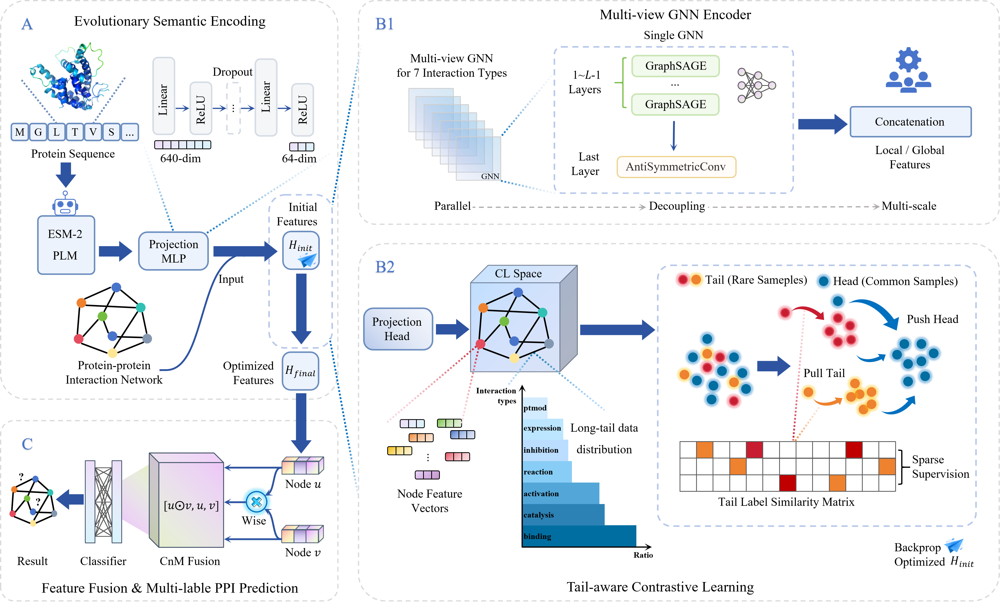

# EvoGraph: Synergizing Evolutionary Semantics and Tail-aware Graph Contrastive Learning for Protein-Protein Interaction Prediction

A novel framework that synergizes deep evolutionary semantics with tail-aware graph representation learning for PPI prediction.

---

## Overview

The framework consists of three modules: (A) Evolutionary Semantic Encoding, which utilizes a pre-trained ESM-2 backbone for initial feature extraction; (B) Tail-aware Graph Contrastive Learning, synergizing a Multi-view GNN Encoder (B1) to capture topological heterogeneity and a Tail-aware Contrastive Learning module (B2) for latent space regularization; and (C) Feature Fusion \& Prediction, employing a hybrid fusion strategy for multi-label classification.


---

## Project Structure

```text
Code/
├─ train.py                      # training & evaluation entry
├─ precomputed_embeddings.py     # offline ESM-2 embedding extraction
├─ src/
│  ├─ model.py                   # EvoGraph model & loss
│  ├─ process.py                 # data loading & splits (bfs/dfs/random/read)
│  ├─ utils.py                   # metrics & utilities
│  └─ embedding.py               # traditional features (placeholder in current pipeline)
└─ data/
   ├─ *.seqs.tsv                 # protein sequences
   ├─ *.actions.txt              # multi-label interaction annotations
   ├─ *_bfs.json / *_dfs.json    # official splits
   └─ *_esm2_emb.pt              # precomputed ESM-2 embeddings

```

---

## Requirements

- Python >= 3.8
- PyTorch (with matching CUDA if available)
- PyTorch Geometric
- fair-esm
- numpy
- scikit-learn
- gensim

Example install (adjust for your CUDA/PyTorch build):

```powershell
pip install torch torchvision torchaudio
pip install torch-geometric fair-esm numpy scikit-learn gensim
```

---

## Data

Included datasets:

- `SHS27K`
- `SHS148K`
- `SYS30K`
- `SYS60K`

Each dataset typically provides:

- `*.seqs.tsv`: protein ID + amino-acid sequence
- `*.actions.txt`: multi-label interaction pairs
- `*_bfs.json` / `*_dfs.json`: fixed splits

---

## Quick Start

### 1) (Optional) Precompute Embeddings

If you do not use the bundled `*_esm2_emb.pt`, you can generate your own:

```powershell
python precomputed_embeddings.py -i data/SHS27K.seqs.tsv -o data/SHS27K_esm2_emb.pt -esm2 esm2_t30_150M_UR50D.pt -b 32
```

> You need to download the ESM-2 weights first, e.g., `esm2_t30_150M_UR50D.pt`.

### 2) Train (Recommended: Use Provided Embeddings)

```powershell
python train.py -m read -i1 data/SHS27K.seqs.tsv -i2 data/SHS27K.actions.txt -i3 data/SHS27K_bfs.json -o result/SHS27K_bfs -precomputed_emb data/SHS27K_esm2_emb.pt -esm2_path esm2_t30_150M_UR50D.pt -e 400 -b 256 -ln 4 -ff CnM -use_contrastive True --lr 0.0005 --weight_decay 5e-4
```

### 3) Other Split Modes

`-m` supports:

- `read`: use an existing split file (`-i3`)
- `bfs`: build a BFS-based split
- `dfs`: build a DFS-based split
- `random`: random split

Example:

```powershell
python train.py -m bfs -i1 data/SHS27K.seqs.tsv -i2 data/SHS27K.actions.txt -o result/SHS27K_bfs_new -precomputed_emb data/SHS27K_esm2_emb.pt
```

---

## Key Arguments

- `-i1`: sequence file (`*.seqs.tsv`)
- `-i2`: interaction labels (`*.actions.txt`)
- `-i3`: split file (required for `read`)
- `-precomputed_emb`: precomputed embedding path (recommended)
- `-esm2_path`: ESM-2 weights path
- `-e` / `-b`: epochs / batch size
- `-ln`: GNN layers
- `-ff`: feature fusion (`CnM` / `concat` / `mul`)
- `-use_contrastive`: enable contrastive learning
- `-contrastive_temp`: contrastive temperature
- `-contrastive_weight`: contrastive loss weight
- `-tail_threshold`: tail-class threshold
- `-loss_type`: `asymmetric` (default) / `bce` / `focal`
- `--lr` / `--weight_decay`: optimizer hyperparameters

---

## Outputs

With `-o result/xxx`, typical outputs include:

- `result/xxx.txt`: per-epoch metrics and config
- `result/xxx_best_model.pt`: best model weights
- `result/xxx.pt`: best-epoch predictions (pred/actual)
- `result/xxx.json`: saved split for `bfs/dfs/random`

---

## Repro Tips

- Prefer the provided `*_esm2_emb.pt` for faster training.
- Use `-m read` with fixed `*_bfs.json` / `*_dfs.json` for fair comparisons.
- Reduce `-b` if GPU memory is limited.

---

## Code Availability

The code and pretrained models will be made publicly available upon acceptance.

---

## License

This project will be released under the MIT License.
